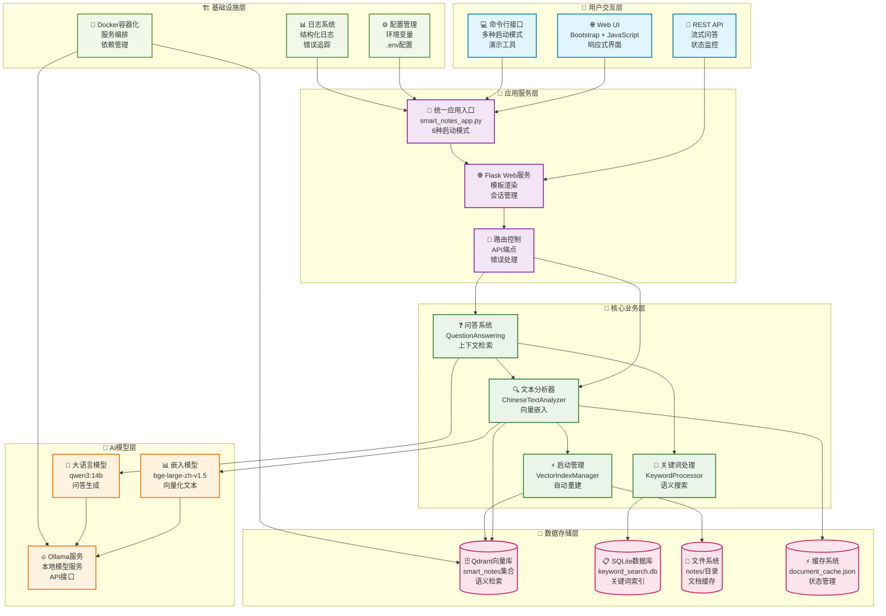
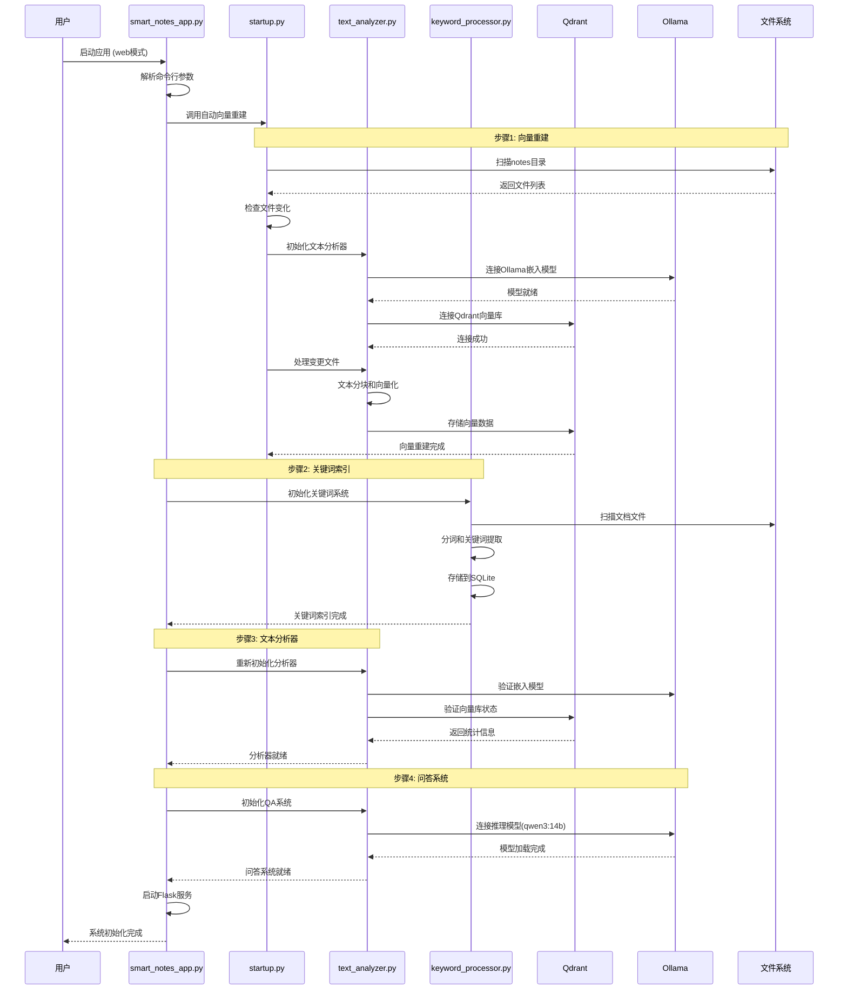
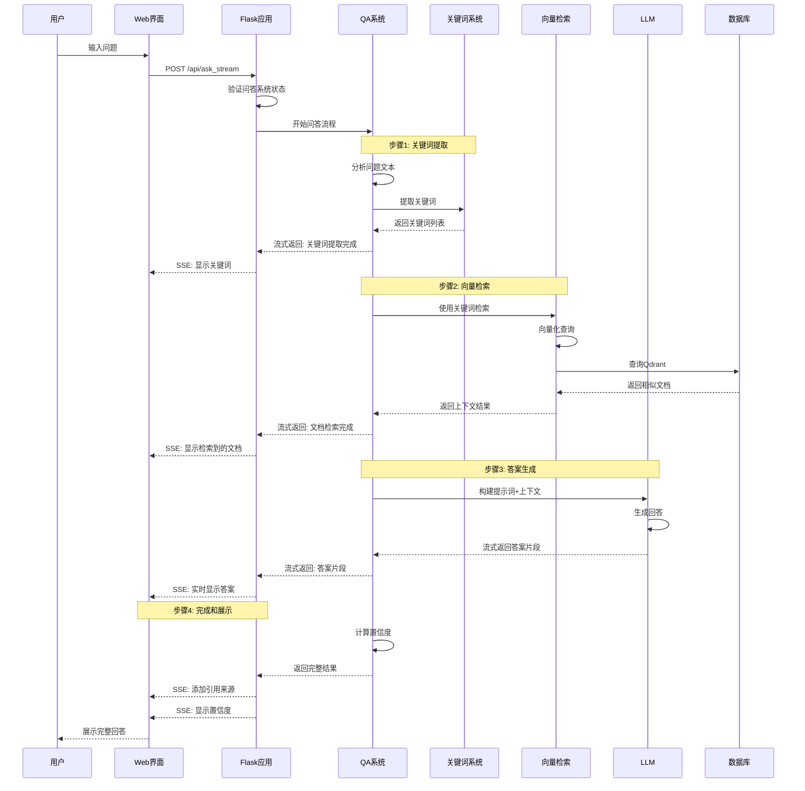
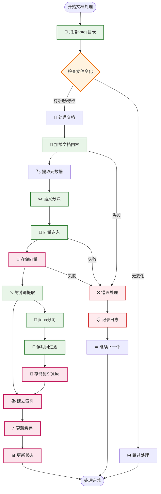
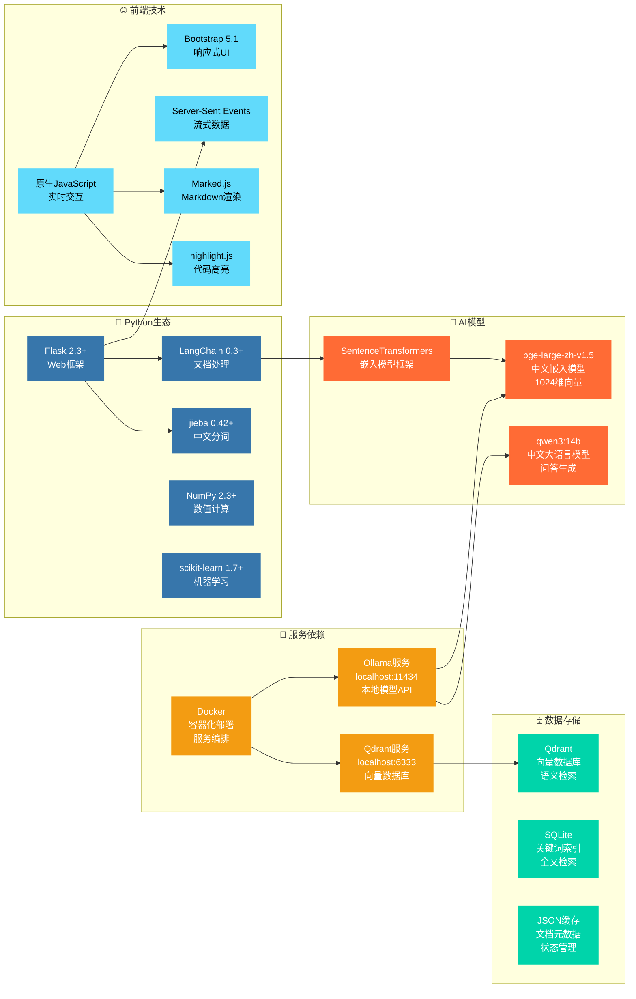
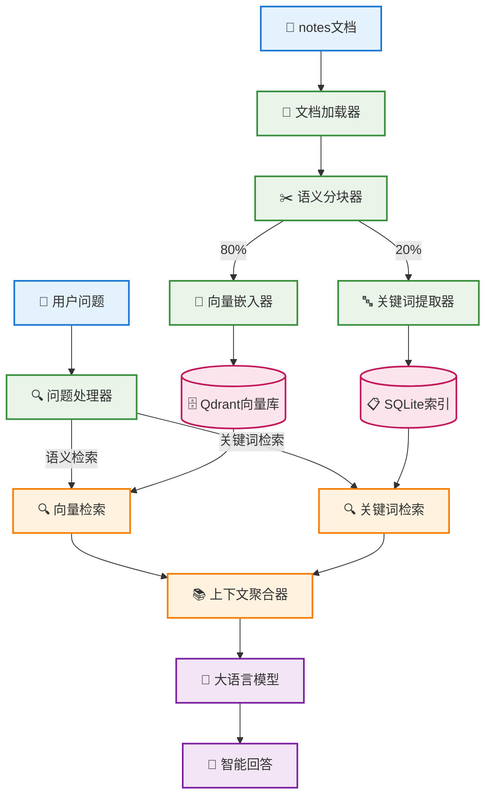
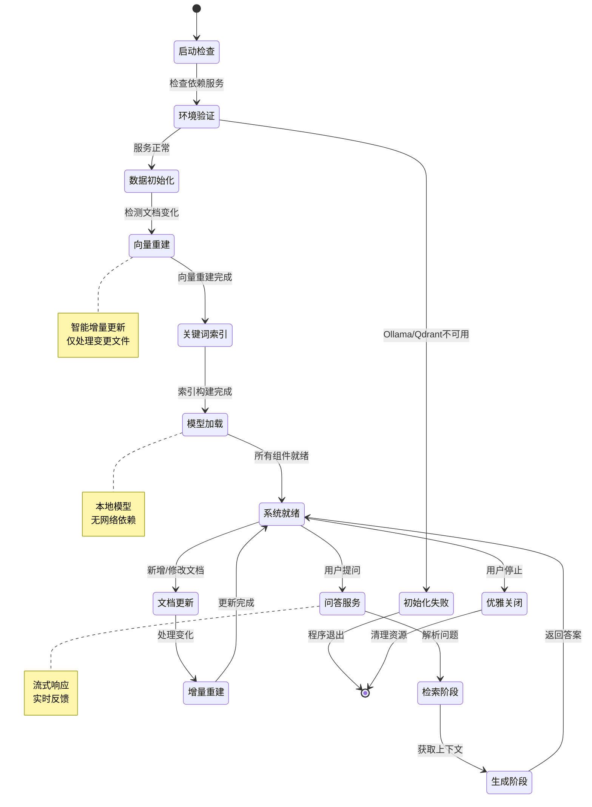

# 「知行」 - 项目架构图与流程图

## 🎯 简要说明

「知行」是一个本地化读书笔记智能助手，旨在为用户提供高效、直观、便捷的个人知识本地管理。

### 🌟 核心功能

- **📚 智能文档处理**: 自动扫描、分析和索引本地文档，支持多种文本格式
- **🔍 混合检索机制**: 结合向量语义检索和关键词精确匹配，提供更准确的搜索结果
- **💬 流式问答体验**: 基于RAG（Retrieval-Augmented Generation）架构的智能文档问答系统，支持上下文理解和推理
- **🏠 本地化部署**: 完全基于本地模型运行，保护数据隐私，无需依赖外部API
- **🔄 增量更新机制**: 智能检测文档变化，只处理新增和修改的内容，提高处理效率
- **🎨 现代化界面**: 响应式Web界面，支持多种交互模式，提供良好的用户体验

### 🚀 技术亮点

- 采用BGE中文嵌入模型进行高质量的语义向量化
- 集成Qdrant向量数据库和SQLite关键词索引的双重检索
- 基于Ollama的本地大语言模型服务（qwen3:14b）
- 支持Server-Sent Events的实时流式响应

## 📊 项目整体架构图

## 🔄 核心功能实现流程图

### 1. 系统初始化流程

### 2. 智能问答流程

### 3. 文档处理流程

## 🏗️ 技术栈依赖关系

## 📊 数据流转关系

## 🔄 系统生命周期

## 📝 项目特色功能

### 🎯 核心优势

1. **🔄 智能增量更新**
   - 基于文件哈希的变化检测
   - 仅处理新增和修改的文档
   - 自动维护向量索引一致性

2. **🚀 流式问答体验**
   - Server-Sent Events 实时推送
   - 分阶段显示处理过程
   - 打字机效果的答案展示

3. **🧠 双重检索机制**
   - 向量语义检索(Qdrant)
   - 关键词精确检索(SQLite)
   - 混合检索提升准确性

4. **🏠 本地化部署**
   - Ollama本地模型服务
   - Docker容器化部署
   - 无需云端API密钥

5. **🎨 现代化界面**
   - 响应式Web设计
   - 实时状态监控
   - 多种交互模式

### 🔧 技术创新

- **语义分块**: 基于句子相似度的智能分块，避免文本割裂
- **中文优化**: 针对中文文本的分词和向量化优化
- **状态管理**: 完整的系统状态跟踪和错误恢复
- **模块化设计**: 清晰的分层架构，易于扩展和维护

这个智能问答系统通过现代化的RAG架构，结合本地化AI模型，为用户提供了一个高效、智能、易用的文档问答解决方案。
